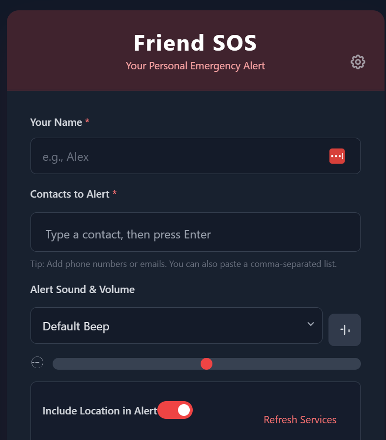
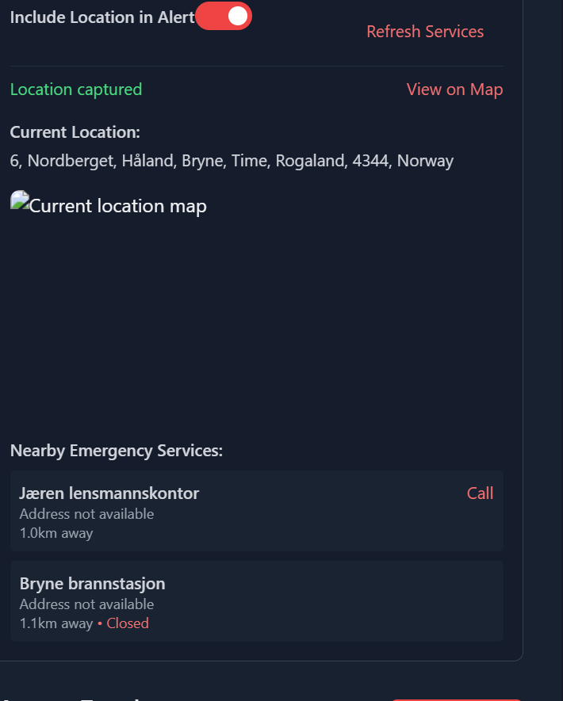
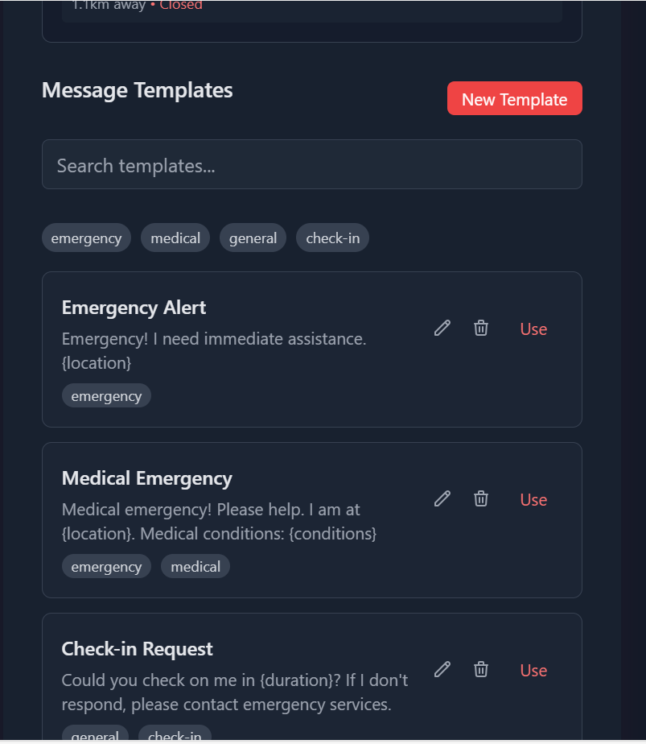
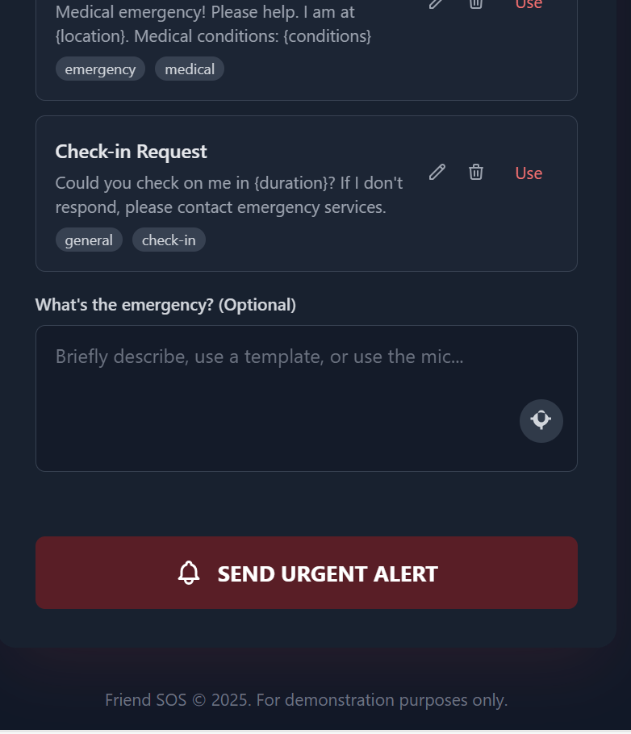

# Friend-SOS - Personal Emergency Alert PWA

[](https://github.com/knoksen/Friend-SOS/releases)
[](https://github.com/knoksen/Friend-SOS/actions)
[](https://github.com/knoksen/Friend-SOS)
[](https://github.com/knoksen/Friend-SOS/commits)
[](https://github.com/knoksen/Friend-SOS/blob/main/LICENSE)
[](https://vercel.com/new/git/external?repository-url=https://github.com/knoksen/Friend-SOS&env=GEMINI_API_KEY,VITE_VAPID_PUBLIC_KEY&project-name=friend-sos&repository-name=friend-sos)
[](https://app.netlify.com/start/deploy?repository=https://github.com/knoksen/Friend-SOS)
[](https://codesandbox.io/p/github/knoksen/Friend-SOS)
[](https://stackblitz.com/github/knoksen/Friend-SOS)
[](https://glitch.com/edit/#!/import/github/knoksen/Friend-SOS)

**Friend SOS** is a modern, installable Progressive Web App (PWA) designed to provide a fast and simple way to send a detailed emergency alert to a predefined list of contacts. It leverages the Google Gemini API to intelligently craft a clear, concise SOS message, and uses your device's native capabilities to dispatch it instantly.

## 📸 Screenshots

|                   Main Screen                   |                   Settings Screen                   |
|:---------------------------------------------:|:--------------------------------------------------:|
|  |  |

|                 Generated Alert                 |                     Voice Input                     |
|:---------------------------------------------:|:--------------------------------------------------:|
|  |  |

---

## 🚀 Live Demo

> **Try it out:** [friend-sos.vercel.app](https://friend-sos.vercel.app)
>
> **Development Preview:** [friend-sos.netlify.app](https://friend-sos.netlify.app)
>
> **GitHub Pages:** [knoksen.github.io/Friend-SOS](https://knoksen.github.io/Friend-SOS)

---

## ✨ Key Features

### 🆘 Core Emergency Features

- **🤖 Multi-Provider AI Alert Generation:** Choose between Gemini, OpenAI, and Anthropic to transform your message into a well-formatted, urgent alert.
- **📲 Multi-Provider SMS Integration:** Support for multiple SMS providers (Twilio, MessageBird) with automatic fallback for enhanced reliability.
- **🗣️ Voice Commands:** Trigger alerts, respond to check-ins, and control the app using natural voice commands (e.g., "Friend SOS emergency").
- **📍 Enhanced Location Services:**
  - Real-time location tracking with periodic updates
  - Reverse geocoding for human-readable addresses
  - Nearby emergency services finder (hospitals, police, fire stations)
  - Static and interactive maps
  - Emergency service contact information

### 👥 Contact Management
- **📇 Comprehensive Contact System:**
  - Contact groups and lists
  - Priority levels
  - Custom notes and tags
  - Import/export functionality
- **✅ Real-time Contact Validation:** Immediate visual feedback for valid emails and phone numbers
- **👥 Emergency Lists:** Create and manage groups of contacts for different scenarios
- **📊 Contact Analytics:** Track message history and response times

### ⏰ Check-in System
- **🔄 Automated Check-ins:**
  - Scheduled periodic check-ins
  - Customizable intervals and duration
  - Multiple notification attempts
  - Escalation system for missed check-ins
- **� Smart Escalation:**
  - Custom escalation delays
  - Prioritized contact notifications
  - Location sharing during escalation
  - Custom escalation messages
- **📝 Check-in History:** Complete log of check-ins and responses

### 📝 Message Templates
- **📋 Template Management:**
  - Contact-specific templates
  - Category-based organization
  - Variable placeholders
  - Usage tracking
- **🏷️ Template Tagging:** Organize templates by purpose or scenario
- **📊 Template Analytics:** Track usage patterns and effectiveness
- **🔄 Dynamic Variables:** Support for location, medical conditions, and custom variables

### 🎵 Alert System
- **🔊 Customizable Alerts:**
  - Multiple alert tones
  - Vibration patterns
  - Volume control
  - Sound preview
- **📱 Multi-Channel Dispatch:**
  - SMS (multiple providers)
  - Voice calls
  - Email
  - WhatsApp
  - Telegram
- **💫 Smart Notifications:**
  - Desktop notifications
  - Sound alerts
  - Visual indicators
  - Haptic feedback

### 💾 Data & Settings
- **🔒 Persistent Storage:**
  - Contacts and groups
  - Templates and preferences
  - Check-in schedules
  - Usage history
- **⚙️ Advanced Settings:**
  - AI provider configuration
  - SMS provider settings
  - Voice command preferences
  - Location update frequency
- **📱 PWA Features:**
  - Offline support
  - Home screen installation
  - Push notifications
  - Background sync

## 🧪 Testing

The project uses a comprehensive testing setup with:

- **Vitest** - Fast Vite-native unit test framework
- **React Testing Library** - Component testing with best practices
- **Playwright** - End-to-end testing

### Running Tests

```bash
# Run all unit tests
npm test

# Run tests in watch mode
npm run test:watch

# Run tests with coverage
npm run test:coverage

# Run end-to-end tests
npm run test:e2e

# Run all tests (CI mode)
npm run test:ci
```

### Test Coverage Goals

- Lines: 80%
- Functions: 80%
- Branches: 80%
- Statements: 80%

### Test Structure

1. **Unit Tests** (`src/__tests__/*.test.ts{x}`):
   - Component tests
   - Service tests
   - Utility function tests

2. **End-to-End Tests** (`e2e/*.spec.ts`):
   - Full user flow testing
   - PWA installation testing
   - Offline functionality testing

## 🛠️ Tech Stack

- **Frontend Framework:**
  - React with TypeScript
  - Vite for build tooling
  - Service Workers (PWA) for offline support
- **Styling & UI:**
  - Tailwind CSS for styling
  - Custom components for alerts, inputs, and settings
- **AI Integration:**
  - Google Gemini (`gemini-2.5-flash`) - Fastest response time
  - OpenAI (`gpt-3.5-turbo`) - Most reliable
  - Anthropic Claude (`claude-3-opus`) - Most advanced
  - Modular provider system for easy extensibility
- **Web APIs:**
  - Web Speech API for voice input
  - Geolocation API for location tracking
  - Web Audio API for alerts
  - Vibration API for haptic feedback

## 🚀 Fast Deployment & Running the App

You can deploy this application in minutes using a service like **Vercel** or **Netlify**.

### Step 1: Get API Keys

The app supports multiple AI providers. You can use any one or all of them:

1. **Google Gemini (Fastest)**
   - Go to the [Google AI Studio](https://aistudio.google.com/)
   - Click on **"Get API key"** and create a new key
   - Save it as `GEMINI_API_KEY`

2. **OpenAI (Most Reliable)**
   - Go to [OpenAI Platform](https://platform.openai.com/api-keys)
   - Create a new API key
   - Save it as `OPENAI_API_KEY`

3. **Anthropic (Most Advanced)**
   - Go to [Anthropic](https://www.anthropic.com/api)
   - Sign up and get an API key
   - Save it as `ANTHROPIC_API_KEY`

**Important:** Keep these keys safe and do not expose them publicly in your client-side code. These will be used as environment variables.

### Step 2: Deploy the Application

You have several options for deployment. Choose the one that best suits your needs:

#### Option 1: GitHub Pages (Recommended for Free Hosting)

1. **Fork this Repository:**
   - Click the "Fork" button at the top right of this page
   - Clone your forked repository locally

2. **Set up Environment:**
   ```bash
   # Create a .env file
   cp .env.example .env
   ```
   Add your API keys to the .env file

3. **Configure Repository Secrets:**
   - Go to Settings > Secrets and variables > Actions
   - Add these required secrets:
     ```
     GEMINI_API_KEY=your_gemini_api_key
     VITE_VAPID_PUBLIC_KEY=your_vapid_public_key
     ```

4. **Enable GitHub Pages:**
   - Go to Settings > Pages
   - Source: GitHub Actions
   - Click "Save"

5. **Deploy:**
   - The app will deploy automatically when you push to main
   - Or manually trigger deployment from the Actions tab
   - Your app will be live at `https://[username].github.io/Friend-SOS`

#### Option 2: One-Click Deploy

Choose your preferred hosting platform:

##### Vercel (Recommended for Production)
[](https://vercel.com/new/git/external?repository-url=https://github.com/knoksen/Friend-SOS&env=GEMINI_API_KEY,VITE_VAPID_PUBLIC_KEY&project-name=friend-sos&repository-name=friend-sos)

1. Click the "Deploy with Vercel" button
2. Connect your GitHub account
3. Configure environment variables:
   - `GEMINI_API_KEY`
   - `VITE_VAPID_PUBLIC_KEY`
4. Click "Deploy"

##### Netlify
[](https://app.netlify.com/start/deploy?repository=https://github.com/knoksen/Friend-SOS)

1. Click the "Deploy to Netlify" button
2. Connect your GitHub account
3. Configure environment variables in Site Settings
4. Deploy will start automatically

##### Railway
[](https://railway.app/new/template?template=https://github.com/knoksen/Friend-SOS&envs=GEMINI_API_KEY,VITE_VAPID_PUBLIC_KEY)

1. Click the "Deploy on Railway" button
2. Connect your GitHub account
3. Configure environment variables
4. Deploy will start automatically

#### Option 3: Development Platforms

For development and testing:

##### CodeSandbox
[](https://codesandbox.io/p/github/knoksen/Friend-SOS)

Perfect for quick testing and development.

##### StackBlitz
[](https://stackblitz.com/github/knoksen/Friend-SOS)

Great for instant development environment setup.

##### Glitch
[](https://glitch.com/edit/#!/import/github/knoksen/Friend-SOS)

Best for remixing and experimentation.

#### Option 4: Manual Deployment

For complete control over your deployment:

1. **Clone the Repository:**
   ```bash
   git clone https://github.com/yourusername/Friend-SOS.git
   cd Friend-SOS
   ```

2. **Install Dependencies:**
   ```bash
   npm install
   ```

3. **Configure Environment:**
   ```bash
   cp .env.example .env
   # Edit .env with your API keys
   ```

4. **Build the Project:**
   ```bash
   npm run build
   ```

5. **Deploy the `dist` folder:**
   - Upload to your web server
   - Configure your server for SPA routing
   - Set up HTTPS (required for PWA features)
   - Configure environment variables

6. **Test the Deployment:**
   - Verify PWA installation works
   - Test push notifications
   - Check offline functionality

## 📲 Installation Guide

Because this is a Progressive Web App (PWA), you can install it on almost any device for a native-app experience.

### Android (Chrome)

1. Open the deployed app URL in Chrome
2. Tap the three-dot menu icon in the top right
3. Select **"Install app"** or **"Add to Home screen"**
4. The Friend SOS icon will appear on your home screen

### iOS (Safari)

1. Open the deployed app URL in Safari
2. Tap the "Share" icon (square with an up arrow)
3. Scroll down and select **"Add to Home Screen"**
4. Confirm the name and tap "Add"

### Desktop (Chrome, Edge)

1. Open the deployed app URL in your browser
2. Look for the "Install" icon in the address bar
3. Click it to install as a desktop application

## 🤝 Contributing

Contributions are welcome! If you have ideas for new features or improvements, please follow these steps:

1. Fork the repository.
2. Create a new branch (`git checkout -b feature/your-feature-name`).
3. Make your changes.
4. Commit your changes (`git commit -m 'Add some amazing feature'`).
5. Push to the branch (`git push origin feature/your-feature-name`).
6. Open a Pull Request.

## License

This project is licensed under the **MIT License**. See the `LICENSE` file for details.
